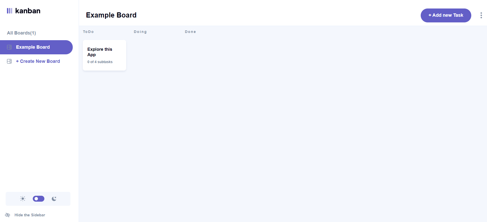

# Frontend Mentor - E-commerce product page solution

This is a solution to the [Kanban task management web app](https://www.frontendmentor.io/challenges/kanban-task-management-web-app-wgQLt-HlbB). Frontend Mentor challenges help you improve your coding skills by building realistic projects.

## Table of contents

- [Overview](#overview)
  - [The challenge](#the-challenge)
  - [Screenshot](#screenshot)
  - [Links](#links)
- [My process](#my-process)
  - [Built with](#built-with)
  - [What I learned](#what-i-learned)
  - [Continued development](#continued-development)
  - [Useful resources](#useful-resources)
- [Author](#author)
- [Acknowledgments](#acknowledgments)

**Note: Delete this note and update the table of contents based on what sections you keep.**

## Overview

This challenge so far is only build for desktop layout. Mobile layout is yet to be done.

### The challenge

Users should be able to:

- View the optimal layout for the site depending on their device's screen size
- See hover states for all interactive elements on the page
- Open a lightbox gallery by clicking on the large product image
- Switch the large product image by clicking on the small thumbnail images
- Add items to the cart
- View the cart and remove items from it

### Screenshot




### Links

- Solution URL: [Add solution URL here](https://github.com/ghintema/FrontEndMentor_Kanban-task-management-web-app.git)
- Live Site URL: [Add live site URL here](https://ghintema.github.io/FrontEndMentor_Kanban-task-management-web-app/)

## My process

- thinking and planing the business logik. 
    - What slices do I need? What state-information do they need to carry? 
    - What actions do I need to handel all the functionality?
- implementing the basic business logik.
- thinking and planing the component-tree.


### Built with

- react
- react-router v5
- react-redux @reduxjs/toolkit 

- Semantic HTML5 via JSX
- flexbox and grid for the layout.

### What I learned

- I gained lots of practice writting business-logik in general. Collecting inputdata via forms and presenting them in lists.
- writting reducers and store using @reduxjs/toolkit.
- I gained lots of practice regarding conditional rendering and conditional attribute-setting.
- implementing night-mode in a react app using the style-attribute.
- implementing hover-states in a react app (wich actually does not exist in react) using 'onMouseEnter' plus 'onMouseLeave'
        Example: <NavLink  className='linkToCreateNewBoard'
                            to= {linkToCreateNewBoard}
                            onMouseEnter={(e) => e.target.classList.add('navLinkHovered')}
                            onMouseLeave={(e) => e.target.classList.remove('navLinkHovered')}>
- I learned, that you trigger two succeding events with one click when you set the onClick for the parent and one of its child element and then clicking the child. The double-call can be prevented by identifying the e.target, in my case searching for specific classes.
        Example:  const closeTheForm = (e) => {

                        // close the form on click of 'formBackground' or 'iconCross'
                        if (e.target.classList.contains('formBackground') ) {
                            history.goBack() // to close the form
                        }
                        if (e.target.classList.contains('closeTheForm') ) {
                            history.goBack() // to close the form
                        }
                    }

- using aria-hidden='true' for non visible dom-elements.


```html
<h1>Some HTML code I'm proud of</h1>
```
```css
.proud-of-this-css {
  color: papayawhip;
}
```
```js
const proudOfThisFunc = () => {
  console.log('🎉')
}
```

### Continued development

So far only designed for desktop. Mobil layout is yet to be done.

### Useful resources

https://developer.mozilla.org/en-US/
https://stackoverflow.com/

## Author

Harm Intemann, Bolivia, November 2022

## Acknowledgments

This is where you can give a hat tip to anyone who helped you out on this project. Perhaps you worked in a team or got some inspiration from someone else's solution. This is the perfect place to give them some credit.

**Note: Delete this note and edit this section's content as necessary. If you completed this challenge by yourself, feel free to delete this section entirely.**
